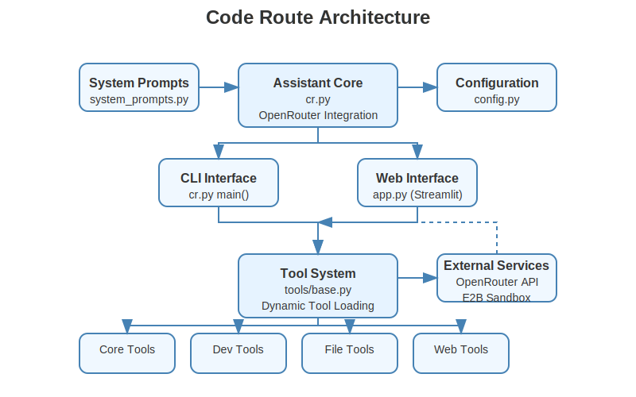

# 🛤️ Code Route: Self-Improving AI Assistant Framework

<div align="center">
  
</div>

## üåü What is Code Route?

Code Route is a revolutionary self-improving AI assistant framework that dynamically creates and manages AI tools during conversations. Unlike traditional AI assistants with fixed capabilities, Code Route can identify the need for new tools, design them, and implement them on the fly - becoming more powerful the more you use it.

### üöÄ Key Innovations

- **Self-expanding capabilities**: Autonomously creates new tools when needed
- **Multi-model support**: Leverages various AI models through OpenRouter API
- **Dual interfaces**: Powerful CLI and modern web UI options
- **Tool orchestration**: Intelligently chains tools for complex tasks
- **Precise token management**: Optimizes context usage for longer conversations

<div align="center">
  
</div>

## üß© System Architecture

Code Route is built around a modular architecture that enables its self-improving capabilities:

### Core Components

1. **Assistant Engine** (`cr.py`): The central component that:
   - Manages conversations and token usage
   - Dynamically loads and executes tools
   - Interfaces with language models via OpenRouter
   - Handles tool execution and result processing

2. **Tool System** (`tools/base.py`): The extensible foundation for all tools:
   - Defines the `BaseTool` abstract class that all tools implement
   - Provides standardized interfaces for tool execution
   - Enables dynamic discovery and loading of new tools
   - Supports tool creation during runtime

3. **System Prompts** (`prompts/system_prompts.py`): Defines the assistant's behavior:
   - Establishes identity and communication protocols
   - Provides tool usage guidelines and policies
   - Sets coding standards and security policies
   - Defines error handling and self-validation procedures

4. **Configuration** (`config.py`): Centralizes system settings:
   - Model selection and parameters
   - Token limits and conversation constraints
   - Path configurations and environment settings
   - Feature toggles and behavior controls

### Interface Options

Code Route offers two powerful interfaces to suit different workflows:

#### 💻 Command Line Interface (CLI)

```bash
uv run cr.py
```

The CLI provides a developer-focused experience with:
- Rich text formatting with syntax highlighting
- Live progress indicators for long-running operations
- Detailed token usage visualization
- Direct tool interaction with verbose output
- Lightweight resource footprint

#### üåê Web Interface (Streamlit)

```bash
uv run app.py
```

The web UI delivers a modern, visual experience with:
- Clean, responsive design for all devices
- Image upload and analysis capabilities
- Real-time token usage visualization
- Markdown rendering with syntax highlighting
- Tool usage indicators and execution tracking

<div align="center">
  
</div>

## 🛠️ Tool Ecosystem

Code Route's power comes from its extensive and expandable tool ecosystem:

### Core Tools
- **Tool Creator** (`toolcreator.py`): The meta-tool that enables self-improvement by generating new tools based on natural language descriptions.

### Development Tools
- **UV Package Manager** (`uvpackagemanager.py`): Manages Python dependencies with the ultra-fast UV package manager.
- **E2B Code Executor** (`e2bcodetool.py`): Runs Python code securely in an isolated sandbox environment.
- **Linting Tool** (`lintingtool.py`): Analyzes and fixes code style issues using Ruff.

### File System Tools
- **Create Folders Tool** (`createfolderstool.py`): Creates directory structures with proper permissions.
- **File Creator** (`filecreatortool.py`): Generates new files with specified content.
- **File Content Reader** (`filecontentreadertool.py`): Reads and processes file contents.
- **File Edit** (`fileedittool.py`): Modifies existing files while preserving encoding.
- **Diff Editor** (`diffeditortool.py`): Makes precise text replacements in files.

### Web Tools
- **DuckDuckGo** (`duckduckgotool.py`): Performs privacy-focused web searches.
- **Web Scraper** (`webscrapertool.py`): Extracts content from websites.
- **Browser** (`browsertool.py`): Opens URLs in the system browser.

### Utility Tools
- **Screenshot Tool** (`screenshottool.py`): Captures screen content for analysis.
- **Weather Tool** (`weathertool.py`): Retrieves weather information for locations.

## 🔄 Self-Improvement Workflow

Code Route's unique self-improvement cycle works as follows:

1. **Need Identification**: During a conversation, the assistant identifies a capability gap
2. **Tool Specification**: The assistant designs a new tool to fill this gap
3. **Code Generation**: Using the Tool Creator, it generates the Python code for the new tool
4. **Validation & Testing**: The code is validated and tested for functionality
5. **Dynamic Loading**: The new tool is automatically loaded into the running system
6. **Immediate Usage**: The assistant can immediately use the new tool in the conversation
7. **Persistent Availability**: The tool remains available for future conversations

This cycle allows Code Route to continuously evolve its capabilities based on user interactions, becoming more powerful and tailored to specific needs over time.

## üöÄ Getting Started

### Prerequisites
- Python 3.9+
- OpenRouter API Key (get one at [openrouter.ai](https://openrouter.ai/))
- E2B API Key (optional, for code execution, get one at [e2b.dev](https://e2b.dev/))

### Installation

#### macOS and Linux
```bash
# Install uv
curl -LsSf https://astral.sh/uv/install.sh | sh

# Clone and setup
git clone https://github.com/micic-mihajlo/cr-py.git
cd cr-py
uv venv
source .venv/bin/activate

# Run CLI or web interface
uv run cr.py  # CLI
# or
uv run app.py  # Web UI
```

#### Windows
```powershell
# Install uv
powershell -ExecutionPolicy ByPass -c "irm https://astral.sh/uv/install.ps1 | iex"

# Clone and setup
git clone https://github.com/micic-mihajlo/cr-py.git
cd cr-py
uv venv
.venv\Scripts\activate

# Run CLI or web interface
uv run cr.py  # CLI
# or
uv run app.py  # Web UI
```

### Configuration

Create a `.env` file in the project root with your API keys:

```bash
OPENROUTER_API_KEY=your_openrouter_key
E2B_API_KEY=your_e2b_key  # Optional
```

## üí° Usage Examples

### Creating a New Tool

```
User: I need a tool that can convert CSV files to JSON format.

Code Route: I can create that for you. Let me design a CSV to JSON conversion tool...
[Tool creation process happens]
‚úÖ Created new tool: CSVToJSONTool

Now I can convert CSV files to JSON. Let me know which file you'd like to convert.
```

### Chaining Multiple Tools

```
User: Find information about climate change, summarize it, and save it to a file.

Code Route: I'll handle that with multiple tools:
1. Using DuckDuckGo to search for climate change information...
2. Analyzing and summarizing the search results...
3. Creating a file with the summary...
‚úÖ File created: climate_change_summary.md
```

### Code Analysis and Execution

```
User: Can you analyze this Python function and optimize it?
def fibonacci(n):
    if n <= 1:
        return n
    return fibonacci(n-1) + fibonacci(n-2)

Code Route: This recursive Fibonacci implementation has exponential time complexity.
Let me optimize it using dynamic programming:

```python
def fibonacci(n):
    if n <= 1:
        return n
    fib = [0, 1]
    for i in range(2, n+1):
        fib.append(fib[i-1] + fib[i-2])
    return fib[n]
```

Would you like me to test the performance difference?
```

## üîç Advanced Features

### Token Management

Code Route implements sophisticated token tracking to maximize the utility of context windows:

- **Real-time monitoring**: Visualizes token usage during conversations
- **Adaptive responses**: Adjusts verbosity based on available context space
- **Efficient history management**: Optimizes conversation history retention
- **Context prioritization**: Ensures critical information remains in context

### Tool Chaining

The system can automatically chain multiple tools together to solve complex problems:

- **Sequential execution**: Passes outputs from one tool as inputs to another
- **Parallel processing**: Runs independent tools simultaneously when possible
- **Error handling**: Gracefully manages failures in tool chains
- **Progress tracking**: Provides visibility into multi-step operations

### Security Features

Code Route implements robust security measures:

- **Sandboxed execution**: Runs code in isolated environments
- **Input validation**: Sanitizes all inputs to prevent injection attacks
- **Credential protection**: Securely handles API keys and sensitive data
- **Permission boundaries**: Restricts tool access to appropriate resources

## üìö Contributing

Contributions to Code Route are welcome! Here's how you can help:

1. Fork the repository
2. Create a feature branch (`git checkout -b feature/amazing-feature`)
3. Commit your changes (`git commit -m 'Add some amazing feature'`)
4. Push to the branch (`git push origin feature/amazing-feature`)
5. Open a Pull Request

For major changes, please open an issue first to discuss what you would like to change.

## 📄 License

This project is licensed under the MIT License - see the LICENSE file for details.

